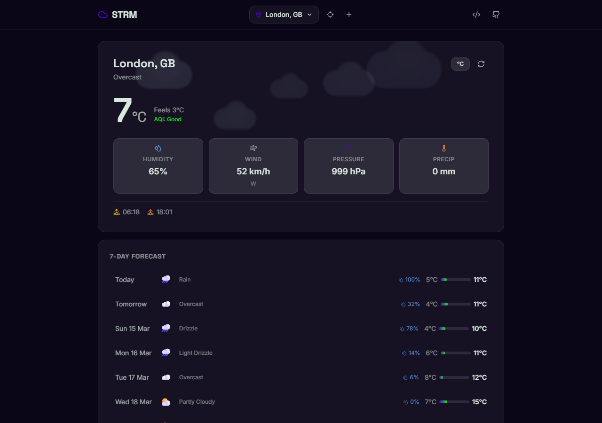
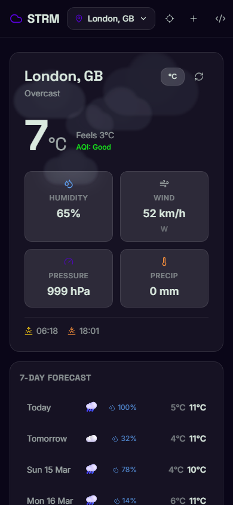

<div align="center">

# ☁️ STRM

### Animated Weather App

[](https://github.com/JoeMighty/STRM/actions/workflows/deploy.yml)
[](https://react.dev/)
[](https://vitejs.dev/)
[](https://tailwindcss.com/)
[](LICENSE)

A dark-mode-only animated weather web app with embeddable widgets and Home Assistant integration.
No API key required.

**[Live Demo →](https://joemighty.github.io/STRM)**

</div>

---

## Screenshots

<div align="center">



<table>
  <tr>
    <td align="center"></td>
  </tr>
  <tr>
    <td align="center"><em>Mobile (390px)</em></td>
  </tr>
</table>

</div>

---

## Features

- **Auto-detect location** on first load via browser GPS
- **Multi-location support** — add, remove, switch up to 5 locations
- **Current weather** — temperature, feels like, humidity, wind, pressure, precipitation, AQI
- **7-day forecast** with precipitation probability and temp range bar
- **8 animated weather backgrounds** — Rain, Snow, Stormy, Sunny, Cloudy, Partly Cloudy, Windy, Foggy
- **Celsius / Fahrenheit toggle**
- **Embeddable widget generator** with iframe embed code
- **Home Assistant integration** — custom weather entity + Lovelace card

---

## Tech Stack

| | |
|---|---|
| **Frontend** | React 18 + Vite |
| **Styling** | Tailwind CSS (dark mode only) |
| **State** | Zustand with localStorage persistence |
| **Animations** | Canvas API + CSS (60fps) |
| **Weather API** | [Open-Meteo](https://open-meteo.com/) — free, unlimited, no key |

---

## Development

```bash
git clone https://github.com/JoeMighty/STRM.git
cd STRM
npm install
npm run dev       # http://localhost:5173/STRM/
npm run build     # production build → dist/
```

---

## Widget Embed

Click the `</>` icon in the header to open the widget generator, pick a size preset, and copy the iframe code.

**Example:**
```html
<iframe
  src="https://joemighty.github.io/STRM/widget.html?lat=51.51&lon=-0.13&name=London&refresh=15"
  width="400" height="300" frameborder="0"
  style="border-radius:8px;"
  title="STRM Weather Widget"
></iframe>
```

**URL Parameters:**

| Parameter | Description | Default |
|-----------|-------------|---------|
| `lat` | Latitude (required) | — |
| `lon` | Longitude (required) | — |
| `name` | Display name | `Weather` |
| `units` | `metric` or `imperial` | `metric` |
| `refresh` | Auto-refresh interval in minutes | `15` |

---

## Home Assistant

### Custom Component

**Via HACS:**
1. HACS → Integrations → ⋮ → Custom repositories
2. Add `https://github.com/JoeMighty/STRM` (category: Integration)
3. Install "STRM Weather" → Restart HA
4. Settings → Devices & Services → Add Integration → **STRM Weather**

**Manual:**
1. Copy `home-assistant/custom_components/strm/` → your HA `custom_components/` directory
2. Restart HA → add via Settings → Devices & Services

---

### Lovelace Card

The animated STRM widget embedded directly in your dashboard.

**Installation:**
1. Copy `home-assistant/www/strm-weather-card.js` → `/config/www/`
2. Settings → Dashboards → ⋮ → Resources → add `/local/strm-weather-card.js` (JavaScript module)
3. Reload the browser

**Configuration:**
```yaml
type: custom:strm-weather-card
lat: 51.51
lon: -0.13
name: London
units: metric    # metric | imperial
refresh: 15      # auto-refresh in minutes
height: 420      # iframe height in px (default: 420)
```

Or link to a STRM weather entity to auto-read coordinates:
```yaml
type: custom:strm-weather-card
entity: weather.strm_51_51__0_13
```

---

## Color Palette

| Swatch | Name | Hex |
|--------|------|-----|
|  | Dark Navy | `#0A0618` |
|  | Primary Purple | `#5601D6` |
|  | Neon Green | `#17EC1C` |
|  | Mint Green | `#DAE9DF` |
|  | Alert Red | `#F70D0D` |

---

## Credits

Created by [Jobin Bennykutty](https://github.com/JoeMighty/) · Powered by [Open-Meteo](https://open-meteo.com/)

## License

[MIT](LICENSE)
